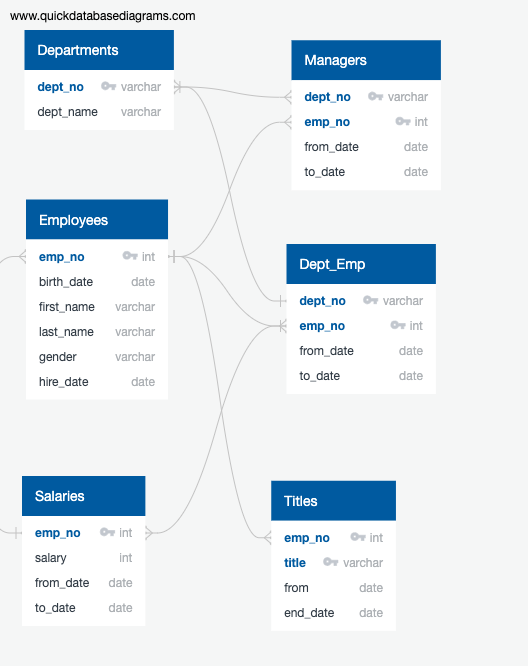
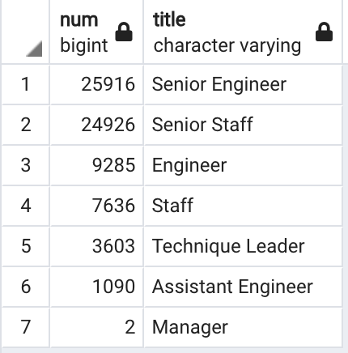
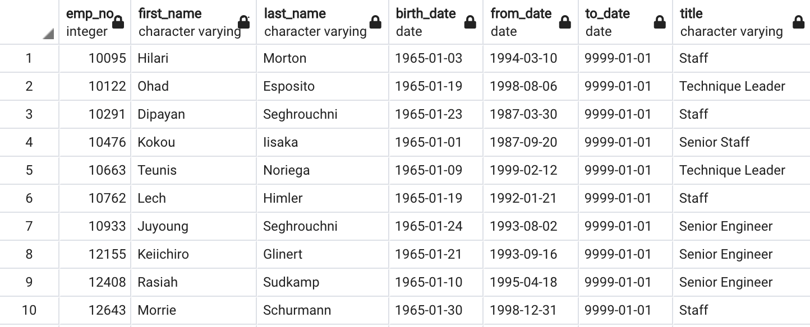

# Pewlett-Hackard-Analysis

## Overview

Pewlett Hackard is a company with thousands of employees, many of which are nearing the age of retirement. The company plans to provide a retirement package to eligible employees. The company must also prepare for thousands of employees leaving their positions within the next few years. To prepare for the future vacancies, we have been assigned to analyze employee data in order to determine: 1) who will be retiring within the next few years 2) the number of positions that will need to be filled 3) the number of retiring employees by title 4) the employees eligible for the mentorship program. The company has provided several tables of employee data, including each employee's name, position, department and birth date. Using SQL, this data can be organized and filtered in order to complete these tasks.

## The Dataset

The data consists of six csv files. To visualize the structure of this data, an entity relationship diagram (ERD) was created, as seen below. The department number and employee number are the data that connect all of these tables to each other. 

## Results

As seen in the table below, roughly 26,000 senior engineers and 25,000 senior staff are soon to retire. As a result, there should be a focus on hiring as many qualified engineers as possible and promote an qualified engineers to the senior engineer position. The same should be done for senior staff. There are also 2 managers near retiring, so 2 replacements need to be found as soon as possible, otherwise there will be a lack of leadership and guidance in the company.

In order to be eligible for the mentorship program, the employee must have been born between January 1, 1965 and December 31, 1965. As seen in the table below, we have the name of the employee, their date of birth, the dates of employment, and their most recent job title. The value "9999-01-01" serves as a placeholder for the final workday of current employees. 

The following conclusions can be made from these two tables:

* 
*
*
*

## Summary

